## Part 1. WatsonX.data Developer installation on Windows
I tried the installation on two OS platforms: MacOS and Windows 11. The reason I'm focusing on Windows 11 in this paper is because I find the early version made available, 1.0.0, to be more difficult to install on that OS. Yet many readers use Windows, so it's useful to know how to install it all. 

1.1. Download WatsonX.data Developer. When you enter the abovementioned link to the announcement, you'll find a link to the Download section too. You may want to use this [link](https://www.ibm.com/account/reg/us-en/signup?formid=urx-54046) too.

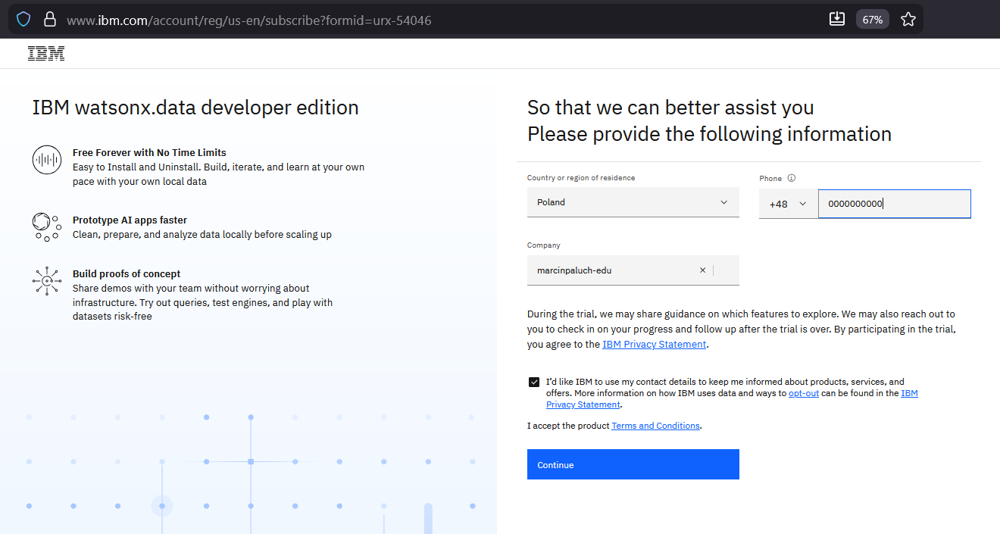

1.2. On the "Thank you for your interest in watsonx.data developer edition" page, select your platform - Mac, Windows or Linux. You may also decided to use SaaS version of WatsonX.data. 

1.3. Windows install has the prerequisite: Windows Linux Service (WSL). Install it first by following the instruction on screen.

```powershell
PS C:\Users\edu> wsl --install
Downloading: Ubuntu
Installing: Ubuntu
Distribution successfully installed. It can be launched via 'wsl.exe -d Ubuntu'
Launching Ubuntu...
Provisioning the new WSL instance Ubuntu
This might take a while...
Create a default Unix user account: marcin
New password:
Retype new password:
passwd: password updated successfully
To run a command as administrator (user "root"), use "sudo <command>".
See "man sudo_root" for details.
edu@<hostname>:/mnt/c/Users/edu$
```

1.4. Click the link "IBM watsonx.data developer edition installer 1.0.0.exe" and accept the license agreement to start the download:
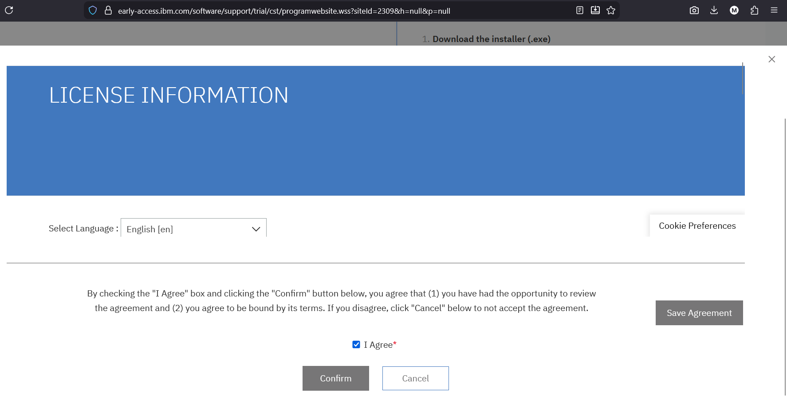

1.5. Execute the downloaded file
1.6. In the Watsonx.data developer edition installer application, check "I accept the IBM watsonx.data developer edition license agreement" and press the blue button "Set up IBM watsonx.data developer edition" button. Then confirm the setup by pressing the Confirm button. Should you miss the agreement text, you can find it [here](https://www.ibm.com/support/customer/csol/terms/?id=L-PLXE-W8DXZZ&lc=en).

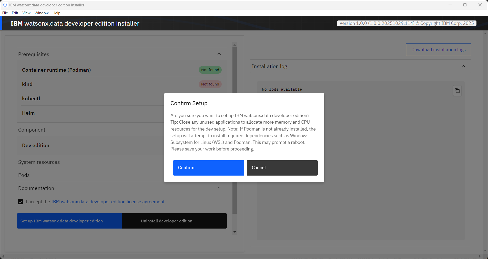

1.7. The Setup program will install all dependencies for you - the Podman container orchestrator, kind K8s cluster, the tools like kubectl or helm. Watsonx.data Developer will come with many pods in your K8s cluster and that means various implications discussed below. Depending on your computer specs, the setup may take a longer or shorter moment to complete. 

**Warning** From now on, I'm describing an issue with the Windows Installer version 1.00, downloaded in November 2025. If you have a newer version, which solves these issues, scroll down to point 1.10.

1.8. The installation will silenty fail at the step of installing the first pod, generate-certs-and-truststore and never recover. The kubernetes cluster node kind-wxd-control-plane will be installed all ok:

```powershell
PS C:\Users\edu> kubectl get nodes
NAME                     STATUS   ROLES           AGE     VERSION
kind-wxd-control-plane   Ready    control-plane   3m34s   v1.34.0
```

But when you check the pods status, you'll see no pods in the wxd namespace:

```powershell
PS C:\Users\edu> kubectl get pods -n wxd
No resources found in wxd namespace.
```

Also helm will not show any release installed:
```powershell
PS C:\Users\edu> helm list -A 

NAME    NAMESPACE       REVISION        UPDATED STATUS  CHART   APP VERSION 

PS C:\Users\edu>
```

You may also notice this JavaScript error on your screen:
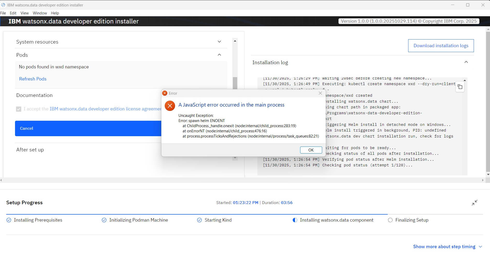

I advise to cancel the installation in that case.
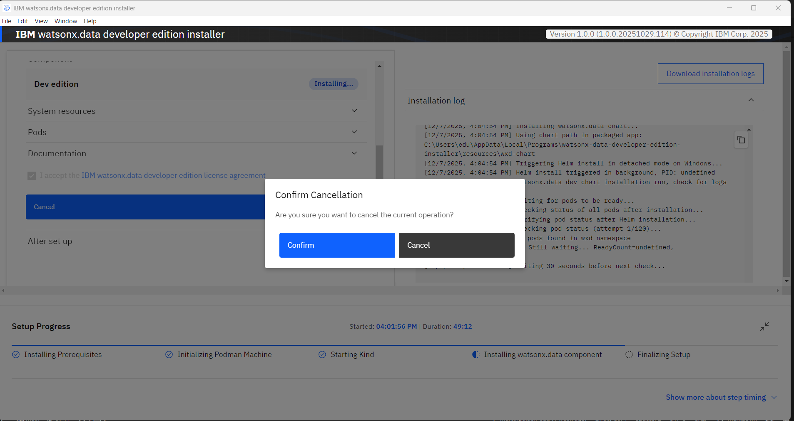
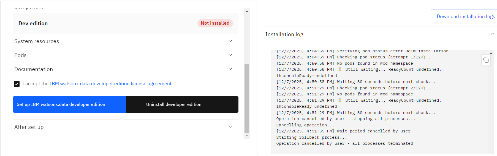

1.9. Turn to Powershell, run it as administrator and perform this manual step instead:
```powershell
 cd $env:HomePath\AppData\Local\Programs\watsonx-data-developer-edition-installer\resources\wxd-chart
 ```
```powershell
helm upgrade --install wxd . -f .\values.yaml -f .\values-secret.yaml --namespace wxd --create-namespace --timeout 120m
```

Alternatively you can switch ```--debug``` flag for greater detail.
```powershell
helm upgrade --install wxd . -f .\values.yaml -f .\values-secret.yaml --namespace wxd --create-namespace --timeout 120m --debug
```

You can track progress either in the Powershell or in the installer view. Although it was stopped, it keeps monitoring installation of the pods:

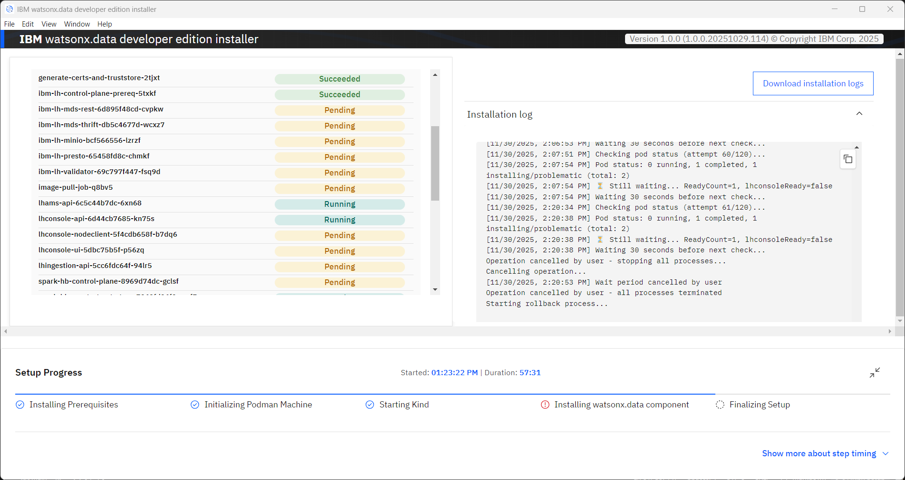

1.10. The installation completes in about 35 minutes on my computer:

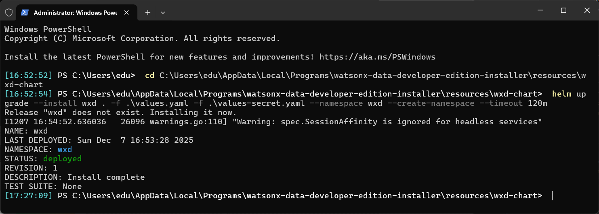

You should also see all the pods installed and running or Succeeded in the Installer GUI:

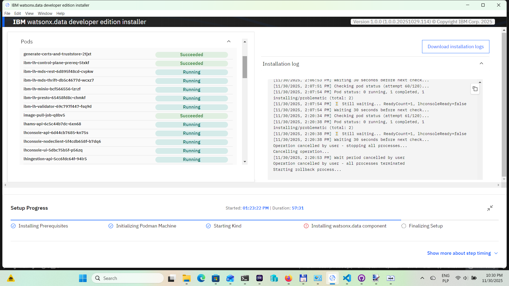
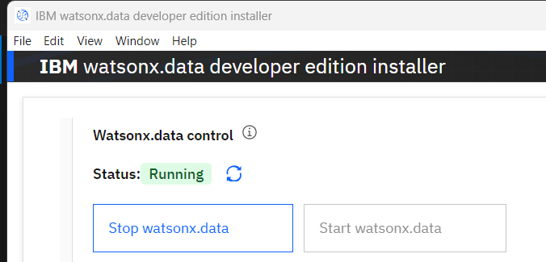

Alternatively, check the helm chart deployment:
```powershell
helm list -A
```
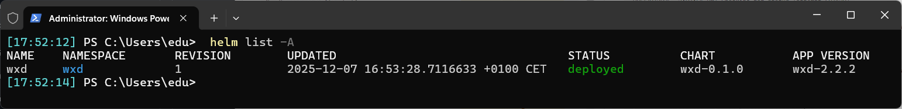

Now, the installation of WatsonX.data Developer Edition on Windows is complex and is running based on four main components: WSL, Podman, kind kubernetes cluster and pods. Let's confirm them all running now OK. 

First we check the podman machine status, which runs inside WSL:

```powershell
podman machine list
```

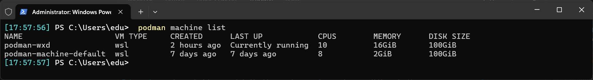


Status of the kind cluster in podman is up:
```powershell
podman ps -a
```

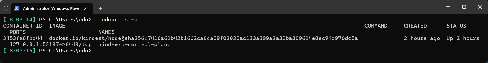

Now let's see the kind kubernetes cluster:

```powershell
kubectl get nodes -o wide
```

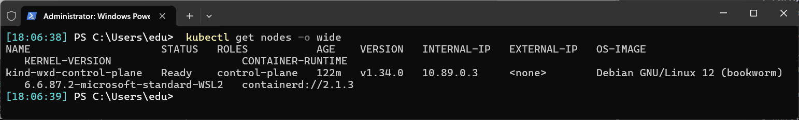

The namespace wxd should show actively used:
```powershell
kubectl get ns
```

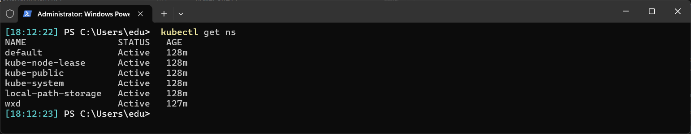


Kubectl get pods should return the exactly same list as UI for the namespace wxd:
```powershell
kubectl get pods -n wxd
```

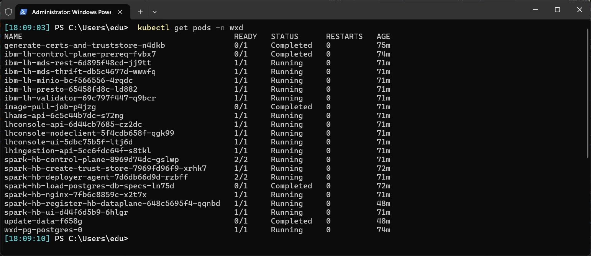


1.11. Go back to the GUI installer and scroll to the After set up section and find Step 1. Run command line. This step will run port-forward command which enables enterring the pod-based watsonx.data developer studio UI via browser by calling localhost address:

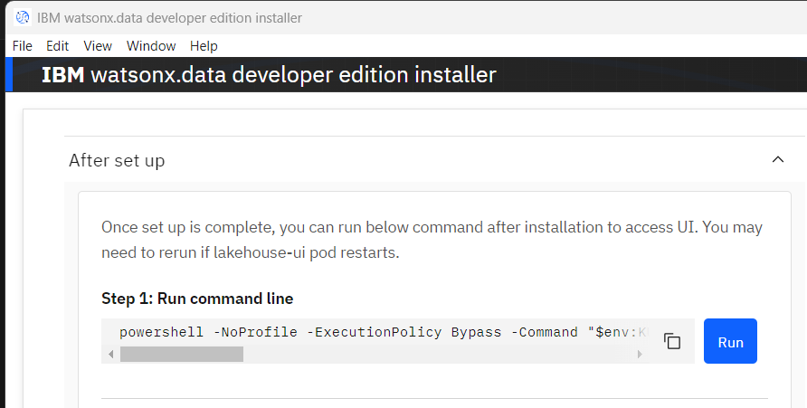

Alternatively You may want to issue this Powershell command too:
```powershell
$env:KUBECONFIG = "$env:USERPROFILE\.kube\config"
Start-Process -WindowStyle Hidden -FilePath kubectl -ArgumentList `
    "port-forward -n wxd service/lhconsole-ui-svc 6443:443 --address 0.0.0.0"
```

1.12. Enter the ```https://localhost:6443/``` URL to your browser or click the URL in Step 2 in the UI, and login with the provided default credentials (user: ibmlhadmin and password: password):

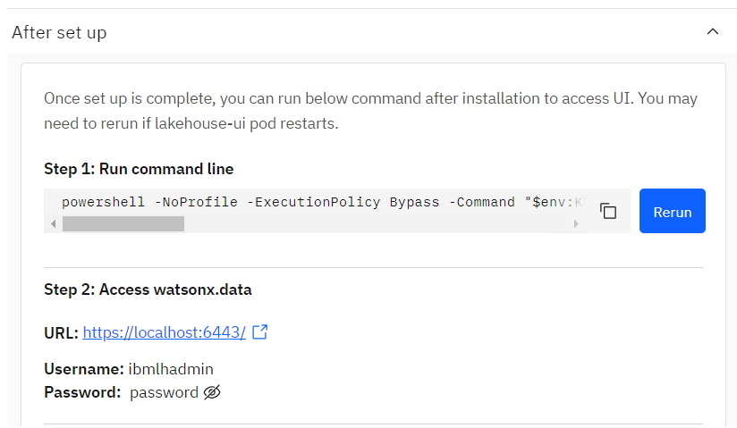

1.13. Accept the self-signed certificate related warning in your browser:
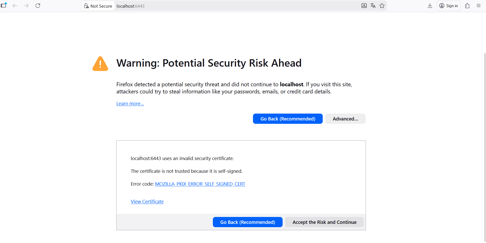

1.14. Login with the previously viewed credentials:
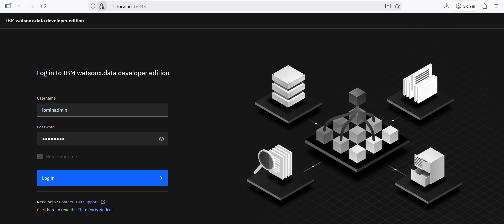

1.15. Welcome to the WatsonX.data Developer Edition landing page!
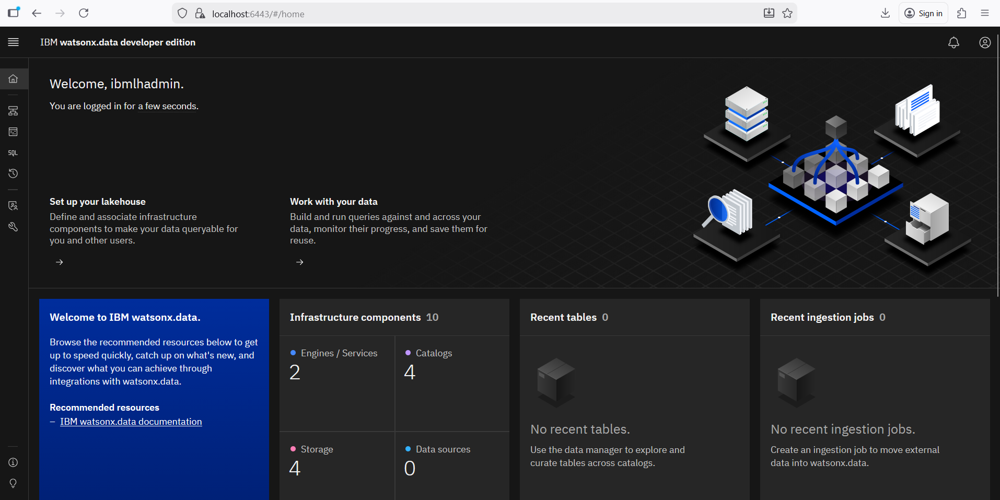

1.16. Navigate to Infrastructure manager view to see the initial components:
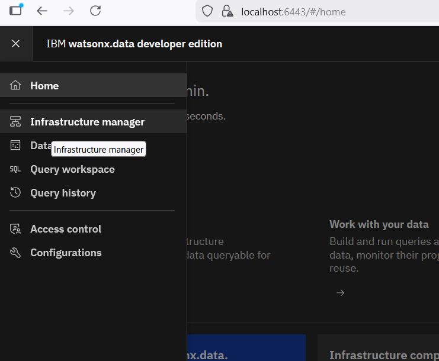

1.17. Welcome to infrastructure manager view:
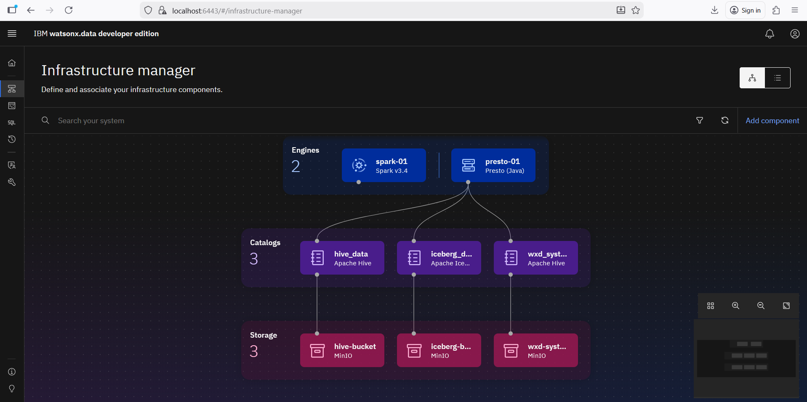


1.18. You can also port-forward ports for MinIO and MDS, by using the WatsonX.data Developer installer UI again
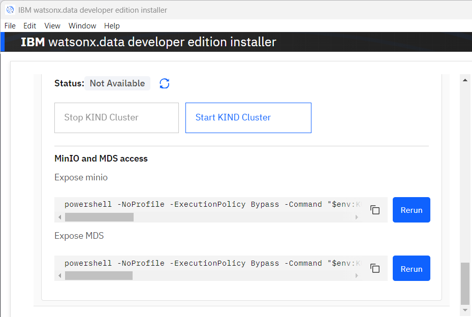

1.19. Test the port-forward for MinIO by trying to open the login page to MinIO (it should be: ```localhost:9001```)
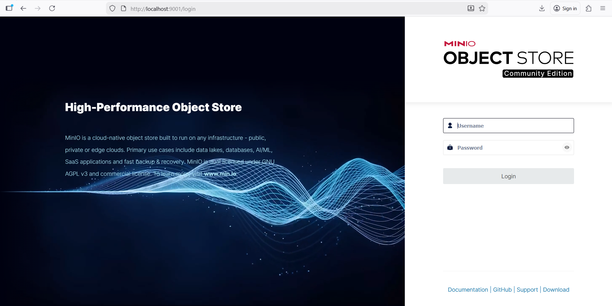

1.20. Should you need to shutdown or restart your Windows 11, your WatsonX.data Developer needs a restart too. In such a case, after logging in to your Windows account again go to your Podman installation and just re-run the kind-wxd-control-plane container. 
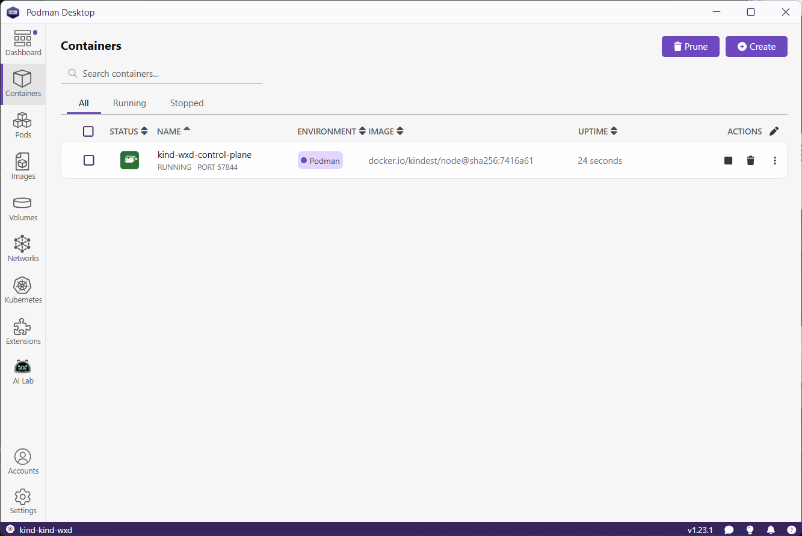

1.21. Remember also of resetting the portforwards setup after you restarted your Windows laptop or save those commands to every startup event. 

After starting it up, you'll be able to login to WatsonX.data Developer again.

This is the end of Part 1. Installation.

[Back to Readme.md](./README.md)
