## Part 3. Data Ingestion (Medallion architecture)

In [IBM WatsonX Data Developer walkthrough - Part 2 - Configuration on Windows 11](./IBM%20WatsonX%20Data%20Developer%20walkthrough%20-%20Part%202%20-%20Configuration%20on%20Windows%2011.md) I described the necessary steps to configure a connection from WatsonX.data Developer Edition version 1.0.0 on Windows 11 OS to locally available data source, such as PostgreSQL database server. I also demonstrated basics of data ingestion in WatsonX.data by using Spark engine and dummy Postgres database built into one of the pods of WatsonX.data Developer.  

In part III. I will further focus on Data Ingestion. I will create new schemas configuration and organize all data into 3 layers: bronze, silver and gold, which follows so called Medallion Architecture, the design pattern for data lakehouses. 

### 3.1. Creating source database

3.1.1. I connect to my locally installed PostgreSQL database server and create new table in the default database `postgres` and in the default schema ```public``` to store simple data of client orders. The orders can be in one of 4 states: pending, paid, shipped or cancelled. 

```sql
CREATE TABLE orders (
    id           BIGSERIAL PRIMARY KEY NOT NULL,
    order_id     BIGINT NOT NULL,
    customer_id  BIGINT NOT NULL,
    product_id   BIGINT NOT NULL,
    amount       NUMERIC(12, 2) NOT NULL CHECK (amount >= 0),
    currency     CHAR(3) NOT NULL,
    status       VARCHAR(32) NOT NULL,
    created_at   TIMESTAMPTZ NOT NULL DEFAULT now()
);

CREATE INDEX idx_orders_order_id  ON orders (order_id);
CREATE INDEX idx_orders_customer_id ON orders (customer_id);
CREATE INDEX idx_orders_product_id  ON orders (product_id);


CREATE TYPE order_status AS ENUM ('pending', 'paid', 'shipped', 'cancelled');

ALTER TABLE orders
    ALTER COLUMN status TYPE order_status
    USING status::order_status;
```

I can check the creation of the datasource correctness in many ways, i.e. in the psql command-line tool for PostgreSQL:

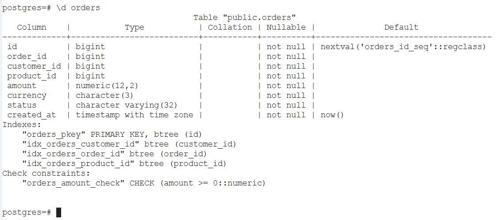

3.1.2. Now I fill the database table with synthetic, generated orders. I insert 10 sample rows into the table. All orders come from different customers and concern different products. I ensure consistency on the level of always one price in given currency for given product for given customer. 

```sql
INSERT INTO orders (id, order_id, customer_id, product_id, amount, currency, status, created_at)
VALUES (1, 1, 101, 1001, 49.99, 'EUR', 'pending',  '2024-11-01 10:15:00+00');

INSERT INTO orders (id, order_id, customer_id, product_id, amount, currency, status, created_at)
VALUES (2, 2, 102, 1002, 129.00, 'USD', 'paid',     '2024-11-01 11:03:00+00');

INSERT INTO orders (id, order_id, customer_id, product_id, amount, currency, status, created_at)
VALUES (3, 3, 101, 1003, 19.50, 'EUR', 'paid',     '2024-11-02 09:42:00+00');

INSERT INTO orders (id, order_id, customer_id, product_id, amount, currency, status, created_at)
VALUES (4, 4, 103, 1001, 49.99, 'EUR', 'cancelled','2024-11-02 14:10:00+00');

INSERT INTO orders (id, order_id, customer_id, product_id, amount, currency, status, created_at)
VALUES (5, 5, 104, 1004, 299.99,'USD', 'paid',     '2024-11-03 16:55:00+00');

INSERT INTO orders (id, order_id, customer_id, product_id, amount, currency, status, created_at)
VALUES (6, 6, 105, 1002, 129.00,'USD', 'shipped',  '2024-11-04 08:20:00+00');

INSERT INTO orders (id, order_id, customer_id, product_id, amount, currency, status, created_at)
VALUES (7, 7, 101, 1005, 9.99,  'EUR', 'paid',     '2024-11-04 12:47:00+00');

INSERT INTO orders (id, order_id, customer_id, product_id, amount, currency, status, created_at)
VALUES (8, 8, 106, 1003, 19.50, 'EUR', 'pending',  '2024-11-05 18:30:00+00');

INSERT INTO orders (id, order_id, customer_id, product_id, amount, currency, status, created_at)
VALUES (9, 9, 107, 1001, 49.99, 'EUR', 'paid',     '2024-11-06 09:05:00+00');

INSERT INTO orders (id, order_id, customer_id, product_id, amount, currency, status, created_at)
VALUES (10, 10, 108, 1004, 299.99,'USD', 'shipped',  '2024-11-06 15:40:00+00');
```

3.1.3. Let's discuss the input data. The 10 statements above generate a list of 10 orders. The all come from 8 different customers (customer_id from 101-108) buying always in one and the same currency each:
```
 customer_id | currency
-------------+----------
         101 | EUR
         102 | USD
         103 | EUR
         104 | USD
         105 | USD
         106 | EUR
         107 | EUR
         108 | USD
```

The 8 customers ordered 5 different products (product_id from 1001-1005) which have fixed pricing and currency (USD or EUR):
```
 product_id | amount | currency
------------+--------+----------
       1001 |  49.99 | EUR
       1002 | 129.00 | USD
       1003 |  19.50 | EUR
       1004 | 299.99 | USD
       1005 |   9.99 | EUR
```
I also can tell I have 7 orders either paid or shipped. This is useful to remember for later in the material.
```
 order_id | created_at | status
----------+------------+---------
        2 | 2024-11-01 | paid
        3 | 2024-11-02 | paid
        5 | 2024-11-03 | paid
        6 | 2024-11-04 | shipped
        7 | 2024-11-04 | paid
        9 | 2024-11-06 | paid
       10 | 2024-11-06 | shipped
```
I can see the inserted rows in many ways, this time in my pgAdmin UI tool:

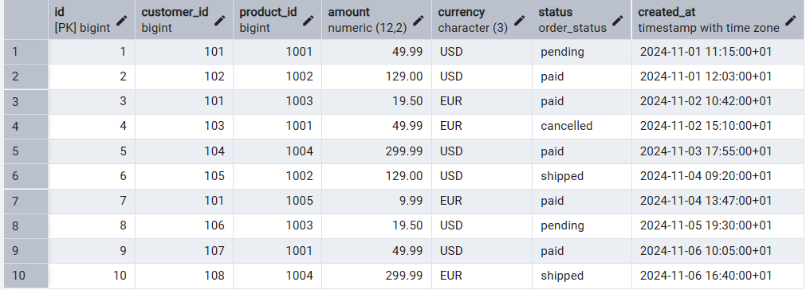

3.1.4. This step ends my activities in the locally installed PostgreSQL database for time being

### 3.2. Create bronze layer in WatsonX.data Apache Iceberg

3.2.1. I switch now to my WatsonX.data Developer.

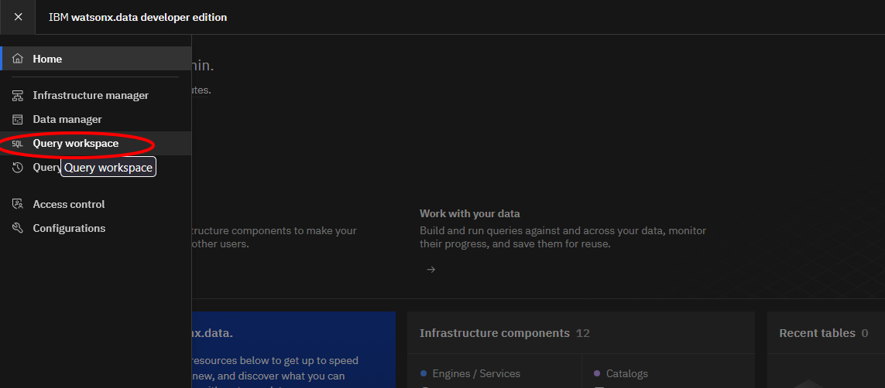

3.2.2. In the Query Workspace I develop this SQL statement for Apache Iceberg/Presto to create new schema and table for client orders. It's supposed to be identical, speaking of columns, with the table I just created in PostgreSQL server. The couple of extra columns I add - `_ingested_at` and `_source`, are for audit purposes. 

```sql
CREATE SCHEMA IF NOT EXISTS bronze;

CREATE TABLE bronze.orders_raw (
    id            BIGINT,
    order_id      BIGINT,
    customer_id   BIGINT,
    product_id    BIGINT,
    amount        DECIMAL(12,2),
    currency      VARCHAR(3),
    status        VARCHAR,
    created_at    TIMESTAMP WITH TIME ZONE,

    _ingested_at  TIMESTAMP WITH TIME ZONE,
    _source       VARCHAR
)
WITH (
    format = 'PARQUET'
);
```
I make sure I select iceberg_data catalog from the drop down (1), I paste the query into the Query editor (2) and I press the blue button `Run query on Presto 01`:

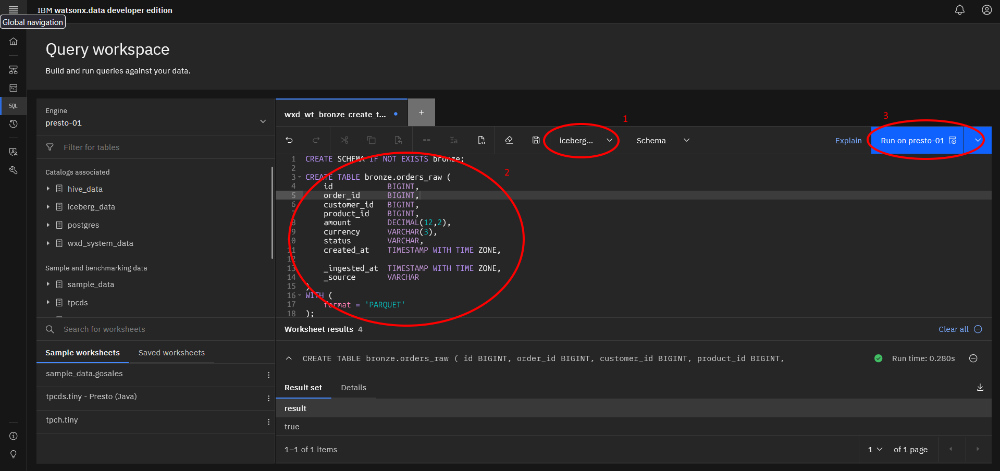

The schema bronze and table orders_raw are now created:

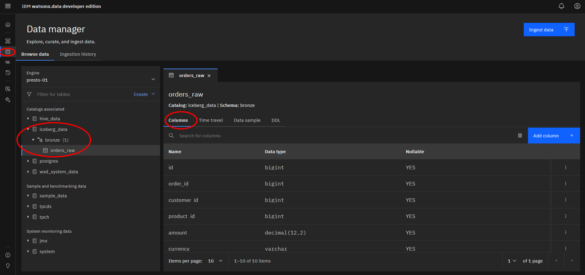

3.2.3. Now I perform my first manual ingestion in Presto/Iceberg, by running new query. I have second option to configure Spark automatic ingestion, and that is the correct way for large data volumes, but I will not use it. Make note: When You do the UI ingestion, it removes any unused columns such as `_ingested_at` or `_source` by default, as they don't exist in the source database table in PostgreSQL. Manual ingestion on another hand can preserve them.
This activity also demonstrates WatsonX.data's capability to federate access to various data sources in a single query from Query Workspace.

```sql
INSERT INTO bronze.orders_raw (
    id,
    order_id,
    customer_id,
    product_id,
    amount,
    currency,
    status,
    created_at,
    _ingested_at,
    _source
)
SELECT
    id,
    order_id,
    customer_id,
    product_id,
    amount,
    CAST(currency AS VARCHAR(3)) AS currency,
    status,
    created_at,
    now()                        AS _ingested_at,
    'postgres.public.orders'     AS _source
FROM postgres.public.orders;
```
I enter the Query workspace and select the Iceberg_data catalog (1) then enter the query (2) and press the _Run on Presto-01_ blue button (3). My query executes ok in below 2 seconds (4) and I now have inserted 10 rows (5).

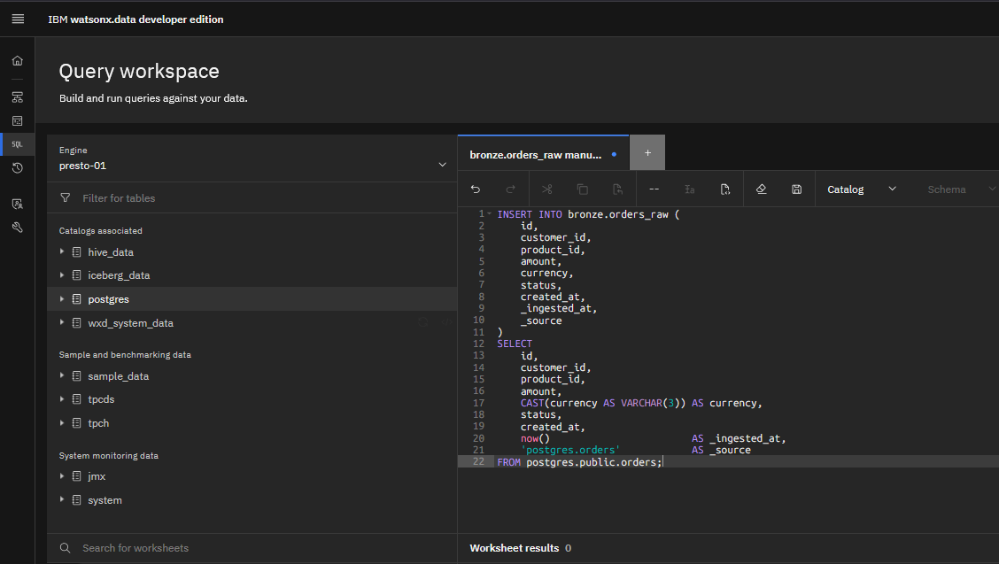

In result, I have all rows from my source PostgreSQL database table `postgres.public.orders` now copied over to WatsonX.data table `iceberg_data.bronze.orders_raw`:

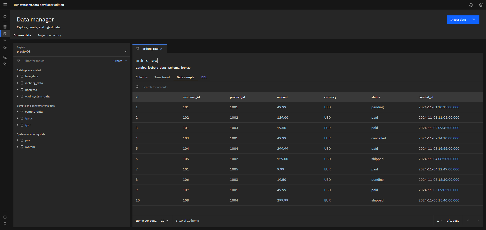


### 3.3. Create silver layer
3.3.1. It's time to create the 2nd layer: silver. My `silver.orders_clean` table will look like `bronze.orders_raw` but it will contain only those orders, which have status `paid` or `shipped`. I make an assumption here that every `shipped` order was `paid` before. I create the table and populate it with values at the same step. This technique is called CTAS, means Create Table As Select. I'm going to preserve the `created_at` timestamp, but I'm going to skip the field `status`. My further interest in this data is based on the assumption that all orders in `silver` were minimum paid. I also cast amount on type _DOUBLE_ for better performance and I only want amounts > 0 for consistency.

```sql
CREATE SCHEMA IF NOT EXISTS silver;

CREATE TABLE silver.orders_clean AS
SELECT
  id,
  order_id,
  customer_id,
  product_id,
  CAST(amount AS DOUBLE) AS amount,
  currency,
  created_at,

  -- metadata
  _ingested_at      AS _bronze_ingested_at,
  current_timestamp AS _processed_at
FROM bronze.orders_raw
WHERE status = 'paid' or status = 'shipped'
  AND amount > 0;
  ```

The query in Query Workspace looks the following:

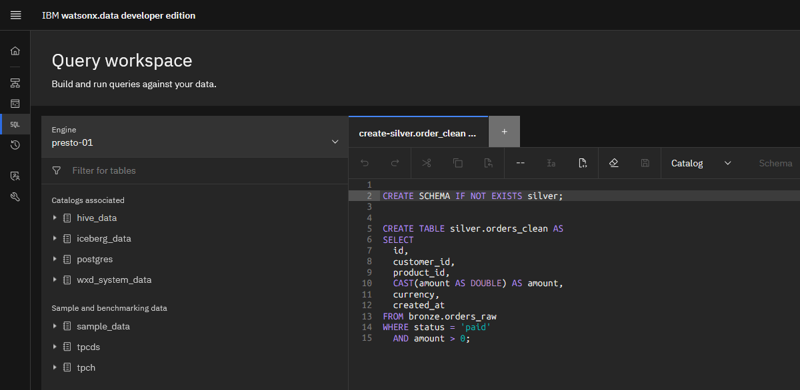

3.3.2. The table was created ok:

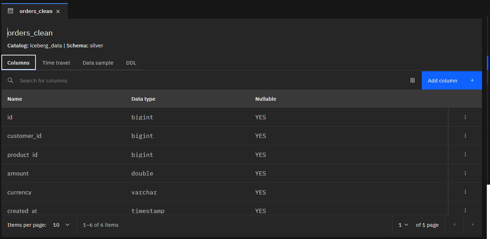

and populated:

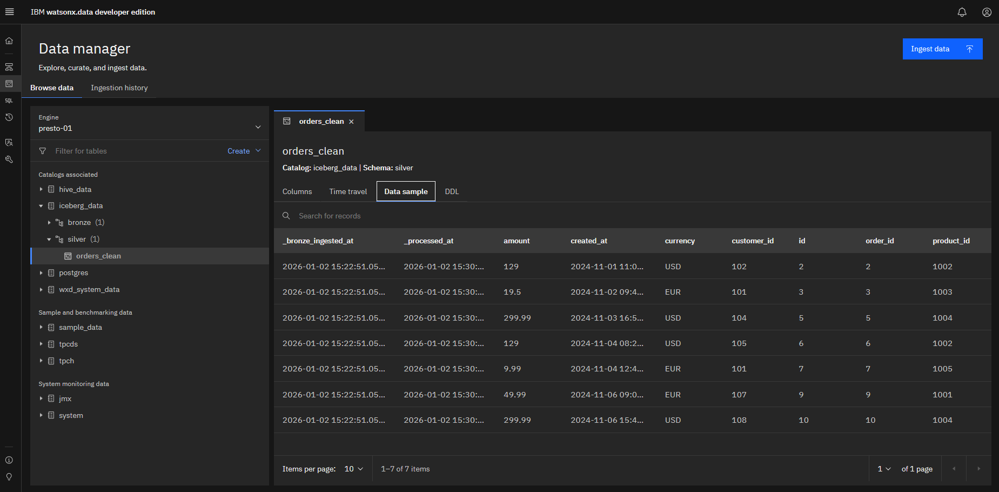

### 3.4. Create gold layer
3.4.1. It's time to create schema gold and two new tables, which will further filter the data from `silver.orders_clean` and ultimately prepare it for final activities like machine learning or business intelligence. I create two tables: 

- ``gold.orders_revenue_daily`` which shows daily revenue I record from orders received at the same day

- ``gold.customer_ltv`` which shows lifetime value of orders put by every client cumulatively

I use similar SQL statement, which creates the `gold` schema and both tables by `CTAS`.

```sql
CREATE SCHEMA IF NOT EXISTS gold;

CREATE TABLE gold.orders_revenue_daily
WITH (
    format = 'PARQUET',
    partitioning = ARRAY['order_date']
)
AS
SELECT
    CAST(created_at AS DATE)          AS order_date,
    currency,
    SUM(amount)                       AS total_revenue,
    COUNT(*)                          AS order_count,
    current_timestamp                 AS _aggregated_at,
    min(created_at)                   AS _min_created_at,
    max(created_at)                   AS _max_created_at
FROM silver.orders_clean
GROUP BY
    CAST(created_at AS DATE),
    currency;

CREATE TABLE gold.customer_ltv
WITH (
    format = 'PARQUET'
)
AS
SELECT
    customer_id,
    currency,
    SUM(amount) AS lifetime_value,
    COUNT(*)    AS orders_count,
    current_timestamp AS _ltv_calculated_at,
    min(created_at)    AS _min_created_at,
    max(created_at)    AS _max_created_at
FROM silver.orders_clean
GROUP BY
    customer_id,
    currency;
```

3.4.2. The table `gold.orders_revenue_daily` was created and populated:

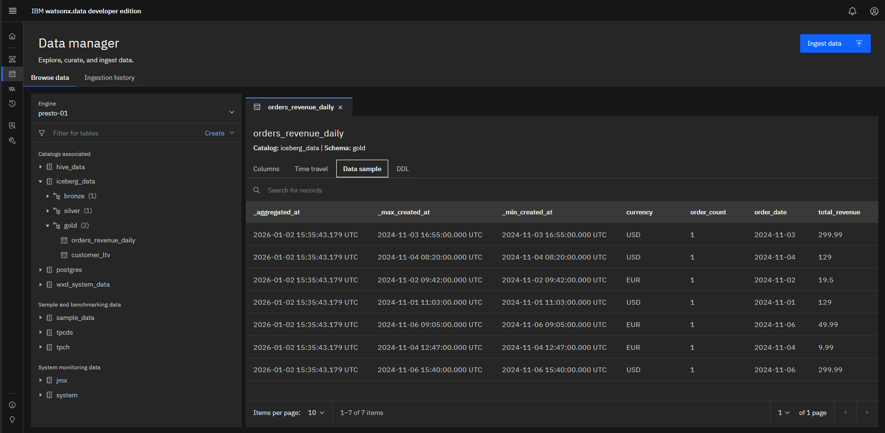

and so was `gold.customer_ltv`:
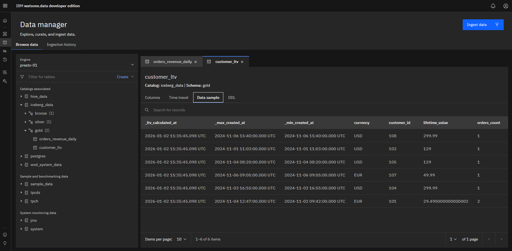

3.4.3. The final structure created is:

```
iceberg_data
├── bronze
│   └── orders_raw
├── silver
│   └── orders_clean
└── gold
    ├── orders_revenue_daily
    └── customer_ltv
```

### 3.5. Incremental / CDC-ready pattern - bronze
For every new ingestion from the source to bronze, I can do either full reloads or incremental loads. I choose incremental add. This approach supports RAG and AI later on, as it ensures auditing and lineage in the table in schema bronze. In this step I show how it works.

Let's start from preparing additional INSERT statements to add extra orders to the source table in PostgreSQL database. I'm preparing 4 types of INSERTs.
- Batch 1) 4 new orders from 4 new customers for 2 new products and 2 repeating products
- Batch 2) 2 new orders from 2 existing customers. One order for one new product (1008) and another for existing product. Customer's currency preference is preserved
- Batch 3) 1 new order cancelling previously paid order
- Batch 4) 1 new order update from 'paid' to 'shipped'
- Batch 5) 2 existing orders change from status pending to paid and from status pending to cancelled. 

3.5.1. I develop the first batch SQL INSERT statements:

```sql
-- Batch 1) 
INSERT INTO orders (id, order_id, customer_id, product_id, amount, currency, status, created_at)
VALUES (11, 11, 201, 1002, 129.00, 'USD', 'paid', '2024-11-07 09:15:00+00');

INSERT INTO orders (id, order_id, customer_id, product_id, amount, currency, status, created_at)
VALUES (12, 12, 202, 1006, 59.99,  'USD', 'pending', '2024-11-07 11:40:00+00');

INSERT INTO orders (id, order_id, customer_id, product_id, amount, currency, status, created_at)
VALUES (13, 13, 203, 1001, 49.99,  'EUR', 'paid', '2024-11-08 14:05:00+00');

INSERT INTO orders (id, order_id, customer_id, product_id, amount, currency, status, created_at)
VALUES (14, 14, 204, 1007, 89.00,  'EUR', 'shipped', '2024-11-08 17:20:00+00');
```
The new summary of my input data would like like the following. I now have 14 total orders, out of which 10 are either paid or shipped:
```
 order_id | created_at | status
----------+------------+---------
        2 | 2024-11-01 | paid
        3 | 2024-11-02 | paid
        5 | 2024-11-03 | paid
        6 | 2024-11-04 | shipped
        7 | 2024-11-04 | paid
        9 | 2024-11-06 | paid
       10 | 2024-11-06 | shipped
       11 | 2024-11-07 | paid
       13 | 2024-11-08 | paid
       14 | 2024-11-08 | shipped
 ``` 
I have 4 new customers (201-204), now total 12:
```
 customer_id | currency
-------------+----------
         101 | EUR
         102 | USD
         103 | EUR
         104 | USD
         105 | USD
         106 | EUR
         107 | EUR
         108 | USD
         201 | USD
         202 | USD
         203 | EUR
         204 | EUR
```
I have total 7 products are in the go, with two new products introduced (1006-1007)
```
 product_id | amount | currency
------------+--------+----------
       1001 |  49.99 | EUR
       1002 | 129.00 | USD
       1003 |  19.50 | EUR
       1004 | 299.99 | USD
       1005 |   9.99 | EUR
       1006 |  59.99 | USD
       1007 |  89.00 | EUR
```

3.5.2. To make it more interesting, I also add new orders from existing clients:
```sql
-- Batch 2) 
INSERT INTO orders (id, order_id, customer_id, product_id, amount, currency, status, created_at)
VALUES (15, 15, 101, 1008, 15.99,  'EUR', 'paid', '2024-11-09 10:30:00+00');

INSERT INTO orders (id, order_id, customer_id, product_id, amount, currency, status, created_at)
VALUES (16, 16, 102, 1004, 299.99, 'USD', 'paid', '2024-11-09 13:45:00+00');
```
I now have 16 orders, out of which I have 12 orders registered in the source database with status either paid or shipped:
```
 order_id | created_at | status
----------+------------+---------
        2 | 2024-11-01 | paid
        3 | 2024-11-02 | paid
        5 | 2024-11-03 | paid
        6 | 2024-11-04 | shipped
        7 | 2024-11-04 | paid
        9 | 2024-11-06 | paid
       10 | 2024-11-06 | shipped
       11 | 2024-11-07 | paid
       13 | 2024-11-08 | paid
       14 | 2024-11-08 | shipped
       15 | 2024-11-09 | paid
       16 | 2024-11-09 | paid
```
No new customer was added. One new product was added - 1008:
```
 product_id | amount | currency
------------+--------+----------
       1001 |  49.99 | EUR
       1002 | 129.00 | USD
       1003 |  19.50 | EUR
       1004 | 299.99 | USD
       1005 |   9.99 | EUR
       1006 |  59.99 | USD
       1007 |  89.00 | EUR
       1008 |  15.99 | EUR
```

3.5.3. I add a scenario of cancelling previously paid order. Here's the INSERT statement for the change:

```sql
-- Batch 3) 
INSERT INTO orders (id, order_id, customer_id, product_id, amount, currency, status, created_at)
VALUES (17, 5, 104, 1004, 299.99,'USD', 'cancelled',     '2024-11-03 16:55:00+00');
```
The table of products didn't change. Also the list of customers didn't change. The list of order entries showing status either paid or shipped will remain flat too, however I'll need to deduplicate the following two entries for the same order number 5:
```
 order_id | created_at |  status
----------+------------+-----------
        5 | 2024-11-03 | paid
        5 | 2024-11-09 | cancelled
```

3.5.4. I change one order from status paid to shipped: 
```sql
-- Batch 4) 
INSERT INTO orders (id, order_id, customer_id, product_id, amount, currency, status, created_at)
VALUES (18, 9, 107, 1001, 49.99, 'EUR', 'shipped', '2024-11-10 16:55:00+00');
```
This change won't introduce any new product or customer. I will have one new order entry in status shipped:
```
 order_id | created_at | status
----------+------------+---------
        2 | 2024-11-01 | paid
        3 | 2024-11-02 | paid
        5 | 2024-11-03 | paid
        6 | 2024-11-04 | shipped
        7 | 2024-11-04 | paid
        9 | 2024-11-06 | paid
       10 | 2024-11-06 | shipped
       11 | 2024-11-07 | paid
       13 | 2024-11-08 | paid
       14 | 2024-11-08 | shipped
       15 | 2024-11-09 | paid
       16 | 2024-11-09 | paid
        9 | 2024-11-10 | shipped
```
This is because the `INSERT` will create double entry for order 9 and I will now have two orders duplicated:
```
 order_id | created_at |  status
----------+------------+-----------
        5 | 2024-11-03 | paid
        5 | 2024-11-09 | cancelled
        9 | 2024-11-06 | paid
        9 | 2024-11-10 | shipped
```
3.5.5. Finally, I'll make two last changes. I'll change two pending orders to status one paid and one cancelled. 
```sql
-- Batch 5) 
--- Order from customer 101, product 1001: pending → paid
INSERT INTO orders (id, order_id, customer_id, product_id, amount, currency, status, created_at)
VALUES (19, 1, 101, 1001, 49.99, 'EUR', 'paid', '2024-11-11 09:00:00+00');

-- Order from customer 106, product 1003: pending → cancelled
INSERT INTO orders (id, order_id, customer_id, product_id, amount, currency, status, created_at)
VALUES (20, 8, 106, 1003, 19.50, 'EUR', 'cancelled', '2024-11-11 10:30:00+00');
```

I'm not going to see new customers or new products again. The number of my active order entries in status either paid or shipped grows by 1 up to total 14: 
```
 order_id | created_at | status
----------+------------+---------
        2 | 2024-11-01 | paid
        3 | 2024-11-02 | paid
        5 | 2024-11-03 | paid
        6 | 2024-11-04 | shipped
        7 | 2024-11-04 | paid
        9 | 2024-11-06 | paid
       10 | 2024-11-06 | shipped
       11 | 2024-11-07 | paid
       13 | 2024-11-08 | paid
       14 | 2024-11-08 | shipped
       15 | 2024-11-09 | paid
       16 | 2024-11-09 | paid
        9 | 2024-11-10 | shipped
        1 | 2024-11-11 | paid
```

And now 4 orders have duplicated entry:
```
 order_id | created_at |  status
----------+------------+-----------
        1 | 2024-11-01 | pending
        1 | 2024-11-11 | paid
        5 | 2024-11-03 | paid
        5 | 2024-11-09 | cancelled
        8 | 2024-11-05 | pending
        8 | 2024-11-11 | cancelled
        9 | 2024-11-06 | paid
        9 | 2024-11-10 | shipped
```
3.5.6. In the last 5 steps I add to my source PostgreSQL `orders` table 10 new order entries but just 6 of them concerned new orders and 4 of them concerned a change to existing orders. In my iceberg_data.bronze.orders_raw table in WatsonX.data I still have just the first 10 added order entries. I try the command below to return just new IDs I haven't copied to bronze yet:
```sql
select o.id 
FROM postgres.public.orders o
WHERE o.id > (
    SELECT COALESCE(MAX(id), 0)
    FROM bronze.orders_raw )
```
The list contains just the 10 new primary keys:
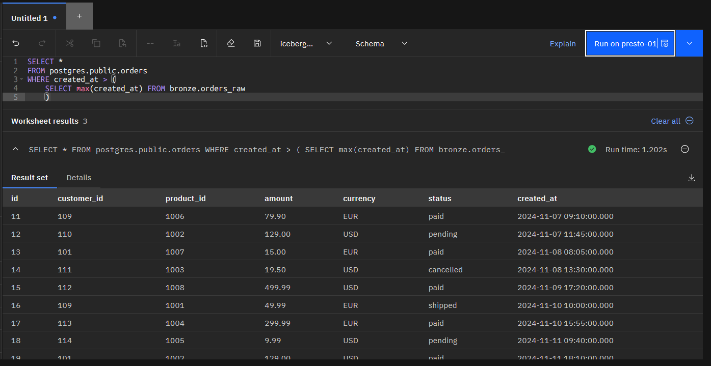

I now add them to `bronze`. Run this command in WatsonX.data Presto:
```sql
INSERT INTO bronze.orders_raw (
    id,
    order_id,
    customer_id,
    product_id,
    amount,
    currency,
    status,
    created_at,
    _ingested_at,
    _source
)
SELECT
    o.id,
    o.order_id,
    o.customer_id,
    o.product_id,
    o.amount,
    CAST(o.currency AS VARCHAR(3)),
    o.status,
    o.created_at,
    now() AS _ingested_at,
    'postgres.public.orders' AS _source
FROM postgres.public.orders o
WHERE o.id > (
    SELECT COALESCE(MAX(id), 0)
    FROM bronze.orders_raw
);
```
The new rows are ingested successfully:
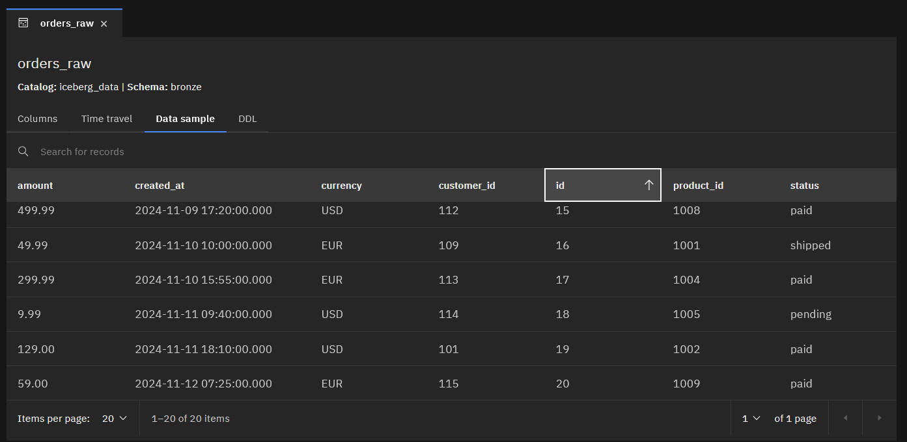

I now want to see the duplicates. I can run the same command against WatsonX.data Iceberg tables and against PostgreSQL source table to detect them:
```sql
SELECT
    order_id,
    CAST(created_at AS DATE) AS created_date,
    status
FROM bronze.orders_raw
WHERE order_id IN (
    SELECT order_id
    FROM bronze.orders_raw
    GROUP BY order_id
    HAVING COUNT(*) > 1
    ORDER BY order_id
)
ORDER BY
    order_id, created_at
```

The result will be see in the Query Workspace:
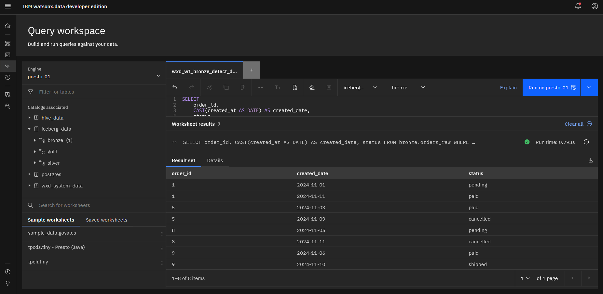

I don't do anything to the duplicates in `bronze` though. Remember that `bronze` is supposed to contain just the same data as the source, duplicates including. I perform the deduplication only in `silver` layer as described in the next step.

### 3.6. Incremental / CDC-ready pattern - silver
Because of having a mix of duplicated and non-duplicated new orders in `bronze`, I need another approach for the 6 new single entries and 4 duplicates to insert them into `silver`. The approach for 6 new single entries is similar to the initial data processing from bronze to silver, already presented in the steps above. But I want to make sure that for any duplicate in bronze I introduce just one and the latest order to silver. And should any order degrade to status cancelled from either status paid or shipped, it needs to be removed from silver completely.  

Additional difficulty is that unlike Trino, WatsonX.data's Presto doesn't support `MERGE INTO` SQL statements, typically used in such situation. If you try it, you'll see the following error in the SQL output:

> This connector does not support MERGE INTO statements

This is why I'll use a combination of DELETE and INSERT statements to deal with the duplicates.

The incremental and CDC-ready pattern for silver schema will assume five scenarios that can happen to data stored in bronze schema:
|#|Case|Solution|Action|Example|
| --- | ----------- | ----------- | ----------- | ----------- | 
|1|new order already paid/shipped|Business as usual, Silver must contain this order|INSERT into Silver|All 6 new orders|
|2|pending → paid|Silver must now contain this order|INSERT into Silver|Order with order_id=1|
|3|paid → shipped|Silver must update row|DELETE old Silver row <br> INSERT new Silver row|Order with order_id=9|
|4|paid → cancelled|Silver must STOP contain this order|DELETE from Silver|Order with order_id=5|
|5|pending → cancelled|Silver must NOT contain this order|Do nothing, Silver never contained this order|Order with order_id=8|

All cases implement one or both of two phases: `DELETE` and `INSERT`. 

3.6.1. DELETE phase covers:
- Case 3 (paid → shipped)
- Case 4 (paid → cancelled)

I know the Case 3 and 4 are about Orders with order_id=5 and 9. Let's see if we can identify them:

```sql
SELECT * FROM silver.orders_clean s
WHERE EXISTS (

SELECT 1
    FROM (
        SELECT customer_id, product_id, MAX(id) AS max_id
        FROM bronze.orders_raw
        GROUP BY customer_id, product_id
    ) b
    WHERE b.customer_id = s.customer_id
      AND b.product_id  = s.product_id
      AND b.max_id      > s.id
      );
```

The result returns order_id 5 and 9:
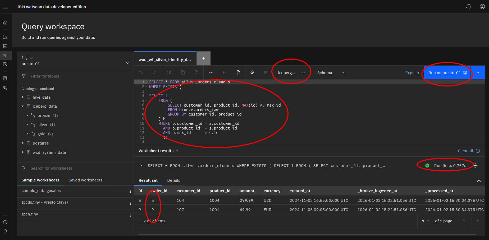

Let's then remove those rows:
```sql
DELETE FROM silver.orders_clean
WHERE EXISTS (
    SELECT 1
    FROM (
        SELECT
            customer_id,
            product_id,
            MAX(id) AS max_id
        FROM bronze.orders_raw
        GROUP BY customer_id, product_id
    ) b
    WHERE b.customer_id = silver.orders_clean.customer_id
      AND b.product_id  = silver.orders_clean.product_id
      AND b.max_id      > silver.orders_clean.id
);
```

The DELETE command removed exactly two rows:
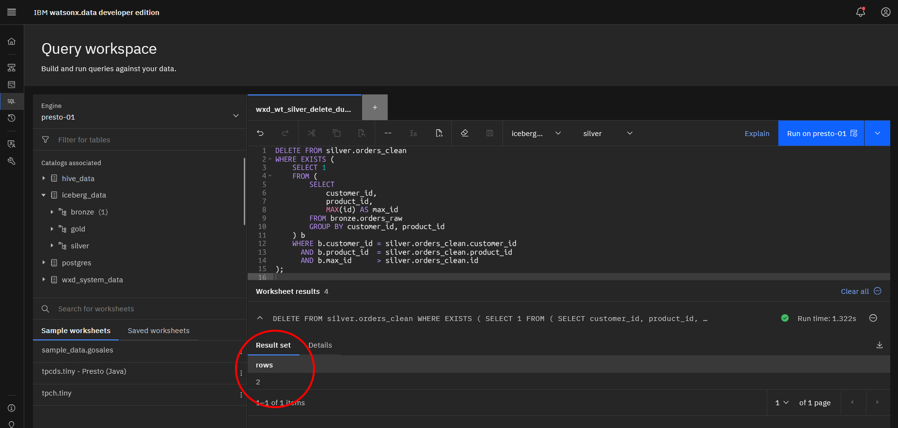

I can now safely introduce all fresh and undeduplicated entries to silver.

3.6.2. INSERT phase covers:
- Case 1 (New orders already paid or shipped)
- Case 2 (pending → paid)
- Case 3 (paid → shipped)

Let's first test what WatsonX.data Presto would hypothetically insert now into silver, after the new rows added to source PostgreSQL and bronze.orders_raw.

```sql
SELECT
    t.id,
    t.order_id,
    t.customer_id,
    t.product_id,
    CAST(t.amount AS DOUBLE) AS amount,
    t.currency,
    t.created_at,
    t._ingested_at      AS _bronze_ingested_at,
    current_timestamp   AS _processed_at
FROM (
    SELECT
        *,
        ROW_NUMBER() OVER (
            PARTITION BY customer_id, product_id
            ORDER BY id DESC
        ) AS rn
    FROM bronze.orders_raw
) t
WHERE t.rn = 1
  AND t.status IN ('paid', 'shipped')
  AND NOT EXISTS (
      SELECT 1
      FROM silver.orders_clean s
      WHERE s.customer_id = t.customer_id
        AND s.product_id  = t.product_id
        AND s.id          = t.id
  ) ORDER BY t.order_id;
```

The result is: 7 orders - 3 new orders for new customers, 2 new orders for existing customers, 1 order promoted from pending to paid and 1 order promoted from paid to shipped but its duplicate with old status paid had to be deleted.

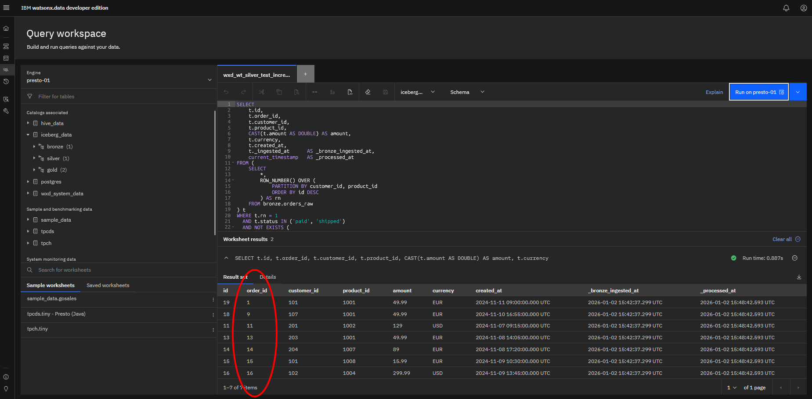

Let's then insert them:
```sql
INSERT INTO silver.orders_clean (
    id,
    order_id,
    customer_id,
    product_id,
    amount,
    currency,
    created_at,
    _bronze_ingested_at,
    _processed_at
)
SELECT
    t.id,
    t.order_id,
    t.customer_id,
    t.product_id,
    CAST(t.amount AS DOUBLE) AS amount,
    t.currency,
    t.created_at,
    t._ingested_at      AS _bronze_ingested_at,
    current_timestamp   AS _processed_at
FROM (
    SELECT
        *,
        ROW_NUMBER() OVER (
            PARTITION BY customer_id, product_id
            ORDER BY id DESC
        ) AS rn
    FROM bronze.orders_raw
) t
WHERE t.rn = 1
  AND t.status IN ('paid', 'shipped')
  AND NOT EXISTS (
      SELECT 1
      FROM silver.orders_clean s
      WHERE s.customer_id = t.customer_id
        AND s.product_id  = t.product_id
        AND s.id          = t.id
  );
```
The result is: 7 inserted rows:
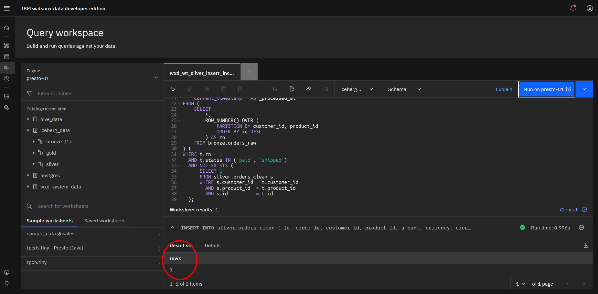

3.6.3. I verify that there's effectively 12 orders now in the silver.orders_clean table, which is correct:


This step ends the incremental / CDC-ready pattern for promoting data from bronze to silver.

### 3.6. Incremental / CDC-ready pattern - gold

The gold tables incremental and CDC-ready pattern is going to be different for every table. The approach will depend on the type of aggregation and the nature of the data in each table. The daily revenue data requires adding new days incrementally, while customer lifetime value will change completely with every batch of new input data. 

What is important is partitioning. In the step [Create gold layer](#34-create-gold-layer) I use the following instruction of the CREATE TABLE statement:
```sql
...
    partitioning = ARRAY['order_date']
...
```
Partitioning is the Iceberg feature, not SQL. It manages how Iceberg groups data files. In Iceberg partitioning is logical, not physical and is defined by partition transforms. Partitions are stored in table metadata so there's no directory coupling and I can change partitioning without rewriting data. Thanks to partitioning only relevant files are scanned and Iceberg metadata is tracking partition specification even before data is read.

In the example above, one logical partition exists per `order_date` and queries filtering on order_date can skip files. When I perform the WHERE clause like below, Iceberg reads only files from that partition:
```sql
WHERE order_date = DATE '2025-12-28'
```
If I append new versions for the same day:
```
(order_date=2025-12-28, _gold_calculated_at=10:00)
(order_date=2025-12-28, _gold_calculated_at=14:00)
```
my WHERE clause still prunes to just that day 2025-12-28.
It is also Trino-upgrade ready, means if I decide to migrate away from WatsonX.data and Presto and just keep your Iceberg tables, if I change the query engine to Trino engine, the partitioning will work still. 

To contrary, the gold table `gold.customer_ltv` doesn't use any type of partitioning. LTV table is going to be small and every BI/AI query usually scans many customers anyway. Partitioning i.e. by customer_id identity would be suboptimal as there's always 1 customer_id per customer and creating one partition per customer_id would result with many small partitions. 

Unfortunately what doesn't work in Presto in WatsonX.data is _bucket partitioning_. Bucket partitioning is used when data offers no natural time partition option and there is high-cardinality dimension (e.g. customers). It also enables more even data distribution. If bucket partitioning was available, my `gold.customer_ltv` table would have this extra part in the CREATE DDL:
```sql
   partitioning = ARRAY['bucket(64, customer_id)']
```
Why buckets - they prevent millions of tiny partitions and ensure even distribution. Thanks to choosing customer_id it could scale to millions of customers. But like I mentioned above bucket partitioning is not available in Presto in WatsonX.data and I won't use any partitioning at all.  

3.6.1. In the light of what I wrote above, the gold table `gold.orders_revenue_daily` grows by date slices. Iceberg uses partitioning to skip files at query time and minimizes file scans, which is why it is perfect for daily aggregates.

Appending recomputed Gold rows approach for `gold.orders_revenue_daily` table requires first check what are the new dates of orders in `silver.orders_clean`. We know from the input data that the new dates are from 2024-11-07 to 2024-11-11. This is the query which can confirm that:

```sql
SELECT DISTINCT CAST(created_at AS DATE) AS order_date
FROM silver.orders_clean
WHERE _processed_at > (
        SELECT COALESCE(MAX(_aggregated_at), TIMESTAMP '1970-01-01')
        FROM gold.orders_revenue_daily
    )
ORDER BY order_date;
```
The new dates are as expected:
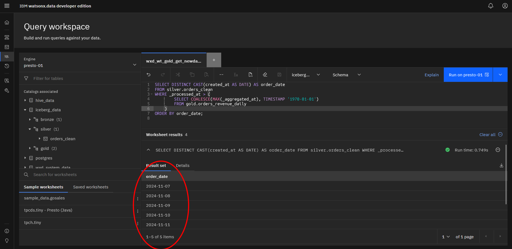

3.6.2. Run the following query to update `gold.orders_revenue_daily` with only new updates:
```sql
INSERT INTO gold.orders_revenue_daily
SELECT
    d.order_date,
    s.currency,
    SUM(s.amount)     AS total_revenue,
    COUNT(*)          AS order_count,
    current_timestamp AS _aggregated_at,
    max(s.created_at) AS _max_created_at,
    min(s.created_at) AS _min_created_at
FROM silver.orders_clean s
JOIN (
    SELECT DISTINCT
           CAST(created_at AS DATE) AS order_date
    FROM silver.orders_clean
    WHERE _bronze_ingested_at > (
        SELECT COALESCE(MAX(_aggregated_at),
                        TIMESTAMP '1970-01-01')
        FROM gold.orders_revenue_daily
    )
) d
  ON CAST(s.created_at AS DATE) = d.order_date
GROUP BY
    d.order_date,
    s.currency
ORDER BY
    d.order_date;
```

The command will pickup 6 entries, including one aggregating 2 orders happening same day in the same currency:

|order_date|currency|total_revenue|order_count|_gold_calculated_at|
| --- | ----------- | ----------- | ----------- | ----------- | 
|2024-11-07|USD|129|1|2026-01-01 23:51:49.861 UTC|
|2024-11-08|EUR|138.99|2|2026-01-01 23:51:49.861 UTC|
|2024-11-09|USD|299.99|1|2026-01-01 23:51:49.861 UTC|
|2024-11-09|EUR|15.99|1|2026-01-01 23:51:49.861 UTC|
|2024-11-10|EUR|49.99|1|2026-01-01 23:51:49.861 UTC|
|2024-11-11|EUR|49.99|1|2026-01-01 23:51:49.861 UTC|

The result of the query execution:
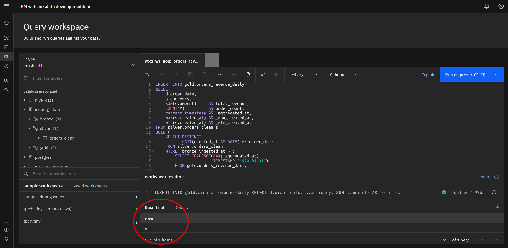

It's worth noticing that although I could detect new or changed Silver rows they're are all inserted with a new order_date and therefore I don't have to recomputes full aggregates for affected dates this time. 

3.6.3. The table `gold.orders_revenue_daily` is now updated with new rows incrementally:
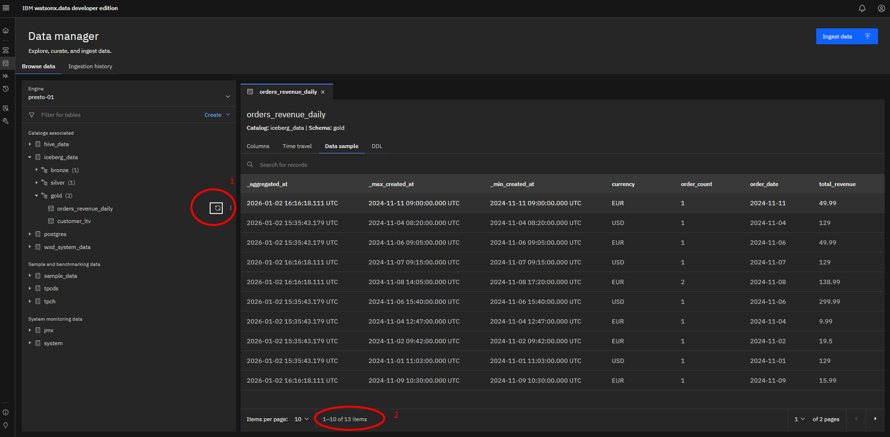

Make note. You may want to refresh your table view after incremental inserts (1). Check the new number of records to confirm the difference (2). 

3.6.4. The approach to updating the client lifetime value is different and I need to rebuild the whole table. I don't have MERGE INTO in Presto at WatsonX.data and that approach of rebuilding the whole table is scalable, aligns with Iceberg best practices and fits watsonx.data constraints.

To rebuilt the whole table I need a brand new one with the freshest data from `silver.orders_clean`. I'm creating a new, temporary table for that with identical schema as the original one:

```sql
CREATE TABLE gold.customer_ltv_tmp
WITH (
    format = 'PARQUET'
)
AS
SELECT
    customer_id,
    currency,
    SUM(amount) AS lifetime_value,
    COUNT(*)    AS orders_count,
    current_timestamp AS _ltv_calculated_at,
    min(created_at)    AS _min_created_at,
    max(created_at)    AS _max_created_at
FROM silver.orders_clean
GROUP BY
    customer_id,
    currency;
```
What is noticeable - the query creates a table with 8 rows while the original table had 6 rows. 

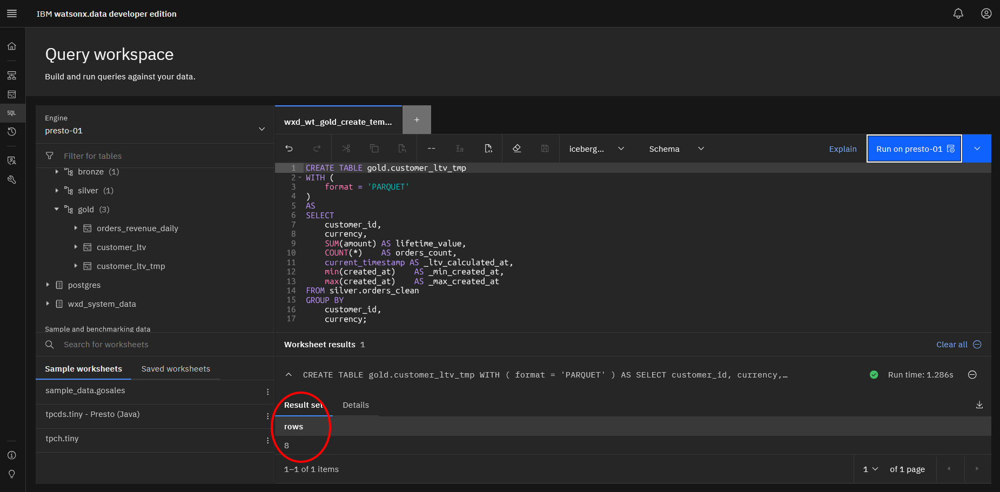

3.6.5. Let's verify if new data in the temporary table reflects the changes I worked on. I'm running a special query designed for that purpose:

```sql
SELECT
    COALESCE(a.customer_id, b.customer_id) AS customer_id,
    COALESCE(a.currency, b.currency)       AS currency,

    a.lifetime_value AS old_ltv,
    b.lifetime_value AS new_ltv,
    b.lifetime_value - a.lifetime_value AS diff_ltv,

    a.orders_count AS old_orders,
    b.orders_count AS new_orders,
    b.orders_count - a.orders_count AS diff_orders
FROM gold.customer_ltv a
FULL OUTER JOIN gold.customer_ltv_tmp b
  ON a.customer_id = b.customer_id
 AND a.currency    = b.currency
WHERE
      a.customer_id IS NULL
   OR b.customer_id IS NULL
   OR a.lifetime_value <> b.lifetime_value
   OR a.orders_count  <> b.orders_count
ORDER BY customer_id;   
   
ORDER BY ABS(b.lifetime_value - a.lifetime_value) DESC;
```

What I get is a listing of 6 rows with new and old lifetime value for all customers, either new or old. I want to see new lifetime value, even if any of my customers resigned from their order and currently have no orders with me (the case of customer 104). This is the result:

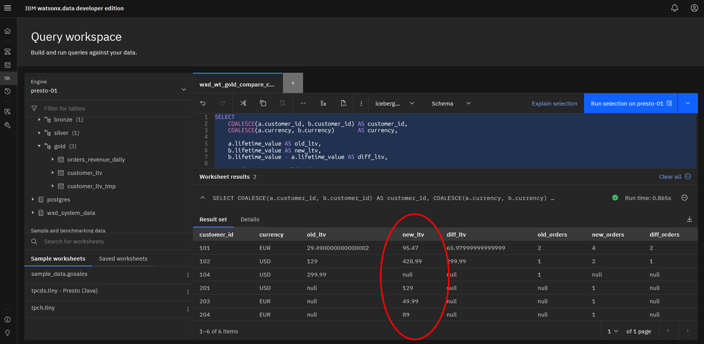

I can prepare more sophisticated report. From the [beginning](#35-incremental--cdc-ready-pattern---bronze) of the incremental pattern discussion I remember I had the following cases:

- 4 new orders from 4 new customers, howver just 3 either paid or shipped and one pending (customer_id 201, 203, 204)
- 2 new orders from 2 existing customers either paid or shipped (customer_id 101 and 102).
- 1 new order cancelling previously paid order (customer_id 104)
- 1 new order update from 'paid' to 'shipped' (customer_id 107)
- 2 existing orders change from status pending to paid and from status pending to cancelled (customer_id 101 and 106)

This means that in comparison to the original data in `gold.customer_ltv` I should see this report in `gold.customer_ltv_tmp`:
- 3 new customers (201, 203, 204)
- increased life time value for client 101 and 102
- lost customer (104)
- no change for customer 106 (eventually cancelled without paying, no revenue) or 107 (the status change only from paid to shipped)

Let's see if I can get the same output from SQL in Presto in WatsonX.data. I'm developing probably the most sophisticated Presto query by far. Here it goes: 

```sql
WITH
-- 1) Normalize both tables to the same grain
old_ltv AS (
    SELECT
        customer_id,
        currency,
        CAST(lifetime_value AS DOUBLE) AS lifetime_value,
        orders_count
    FROM gold.customer_ltv
),

new_ltv AS (
    SELECT
        customer_id,
        currency,
        CAST(lifetime_value AS DOUBLE) AS lifetime_value,
        orders_count
    FROM gold.customer_ltv_tmp
),

-- 2) Full comparison
diff AS (
    SELECT
        COALESCE(o.customer_id, n.customer_id) AS customer_id,
        COALESCE(o.currency, n.currency)       AS currency,

        o.lifetime_value AS old_lifetime_value,
        n.lifetime_value AS new_lifetime_value,
        COALESCE(n.lifetime_value, 0)
          - COALESCE(o.lifetime_value, 0)      AS lifetime_value_diff,

        o.orders_count AS old_orders_count,
        n.orders_count AS new_orders_count,
        COALESCE(n.orders_count, 0)
          - COALESCE(o.orders_count, 0)        AS orders_count_diff,

        CASE
            WHEN o.customer_id IS NULL THEN 'NEW_CUSTOMER'
            WHEN n.customer_id IS NULL THEN 'REMOVED_CUSTOMER'
            WHEN ABS(n.lifetime_value - o.lifetime_value) > 0.01
                 AND n.lifetime_value > o.lifetime_value
                 THEN 'LTV_INCREASE'
            WHEN ABS(n.lifetime_value - o.lifetime_value) > 0.01
                 AND n.lifetime_value < o.lifetime_value
                 THEN 'LTV_DECREASE'
            WHEN n.orders_count <> o.orders_count
                 THEN 'ORDER_COUNT_CHANGE'
            ELSE 'NO_CHANGE'
        END AS change_type
    FROM old_ltv o
    FULL OUTER JOIN new_ltv n
      ON o.customer_id = n.customer_id
     AND o.currency    = n.currency
)

-- 3) Final result: only meaningful differences
SELECT *
FROM diff
WHERE change_type <> 'NO_CHANGE'
ORDER BY
    lifetime_value_diff DESC,
    CASE change_type
        WHEN 'LTV_DECREASE' THEN 1
        WHEN 'REMOVED_CUSTOMER' THEN 2
        WHEN 'LTV_INCREASE' THEN 3
        WHEN 'NEW_CUSTOMER' THEN 4
        WHEN 'ORDER_COUNT_CHANGE' THEN 5
        ELSE 99
    END;    
```
And here's the result of my query:
| customer_id | currency | old_lifetime_value | new_lifetime_value | lifetime_value_diff | old_orders_count | new_orders_count | orders_count_diff | change_type        |
|-------------|----------|--------------------|--------------------|---------------------|------------------|------------------|-------------------|--------------------|
| 102         | USD      | 129                | 428.99             | 299.99              | 1                | 2                | 1                 | LTV_INCREASE       |
| 201         | USD      | null               | 129                | 129                 | null             | 1                | 1                 | NEW_CUSTOMER       |
| 204         | EUR      | null               | 89                 | 89                  | null             | 1                | 1                 | NEW_CUSTOMER       |
| 101         | EUR      | 29.49              | 95.47              | 65.98               | 2                | 4                | 2                 | LTV_INCREASE       |
| 203         | EUR      | null               | 49.99              | 49.99               | null             | 1                | 1                 | NEW_CUSTOMER       |
| 104         | USD      | 299.99             | null               | -299.99             | 1                | null             | -1                | REMOVED_CUSTOMER   |

And the same on the screenshot of WatsonX.data Developer Query workspace:
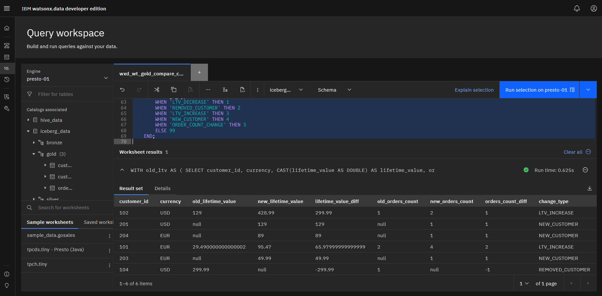

I can see that I can indeed expect an increase from 2 customers - 101 and 102. Btw. I made the most money on customer_id 102 (428.99 USD), although customer_id 101 made the most of the orders (4 orders). I'm indeed loosing customer 104 and indeed customers 201, 203 and 204 are going to be shown as new. This means I'm moving from 6 to 8 customers in my report after adding new orders. 

3.6.6. I finally do the full replacement. I run query:
```sql
DROP TABLE gold.customer_ltv;
ALTER TABLE gold.customer_ltv_tmp
RENAME TO customer_ltv;
```
As usual I need to select the catalog (1 - Iceberg_data), then enter my query (2), then press the blue button (3). Because my query consists of 2 activities - DROP and ALTER, I'm going to see two queries result (4 and 5). At the end I refresh the listing of tables in the tree-view (6) to see just customer_ltv, without customer_ltv_tmp.

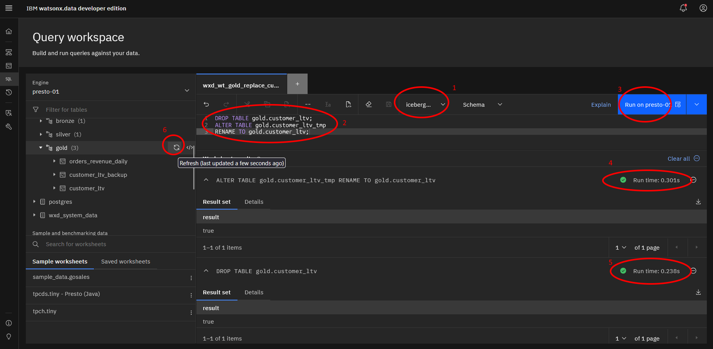

I go to the Data manager view to see my new `gold.customer_ltv` data sample:

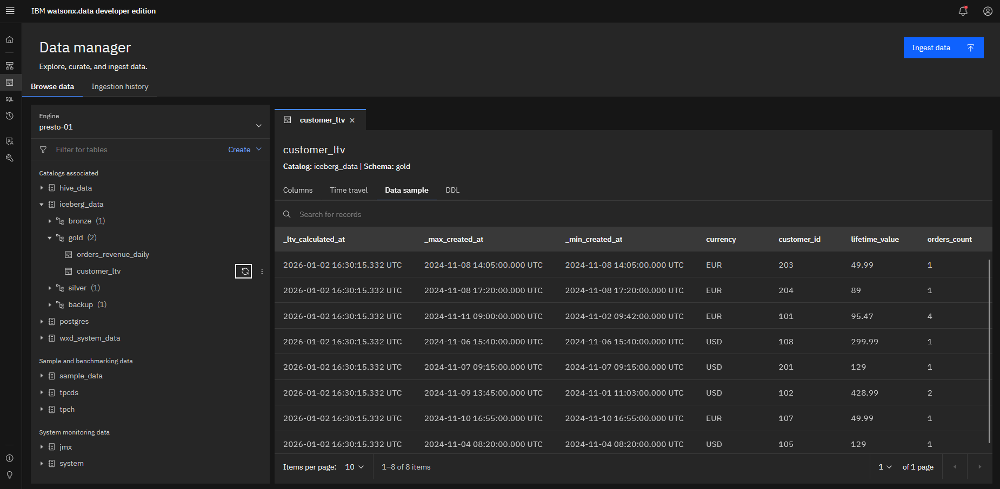

It indeed shows now 8 customers result for life time value (revenue).

This is the end of Part 3. Data Ingestion (Medallion architecture).

[Back to Readme.md](./README.md)


