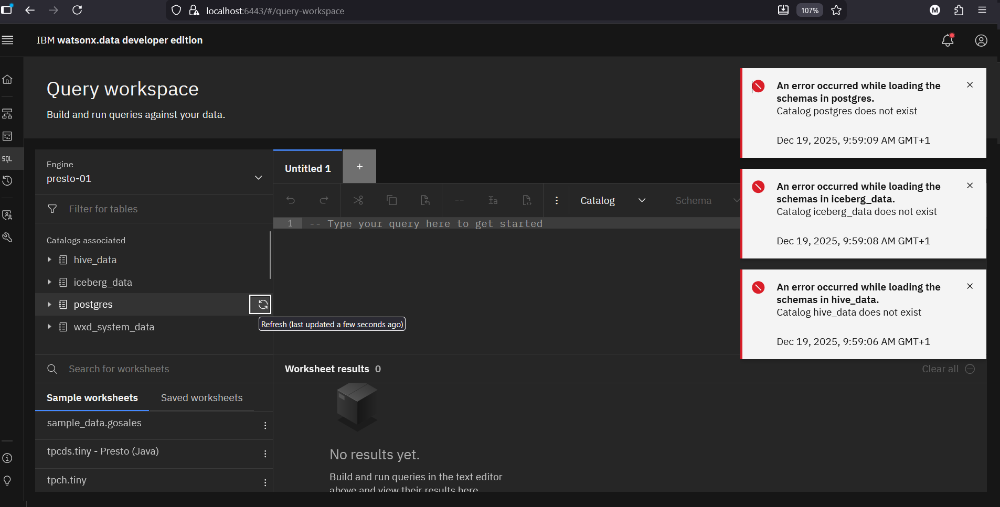
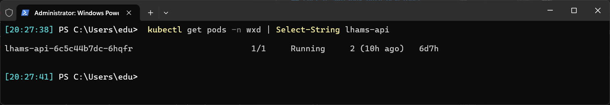
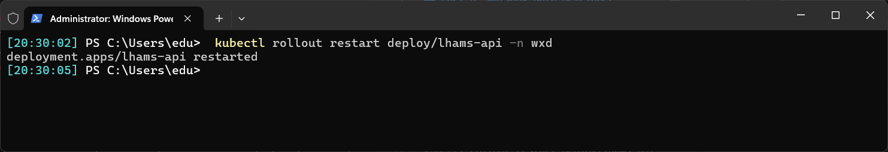
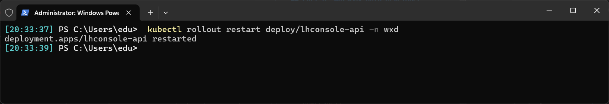
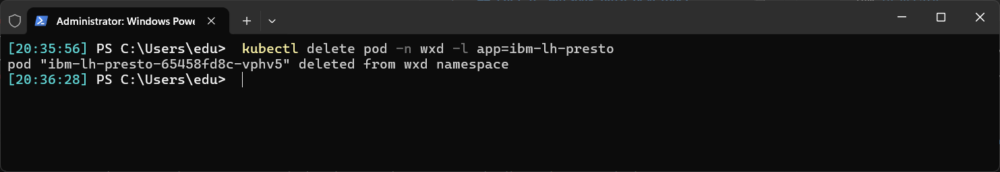
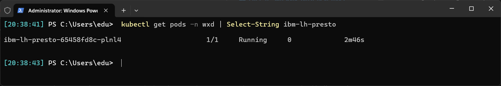
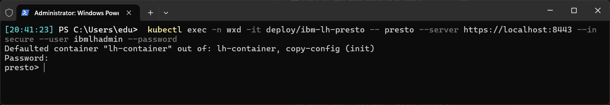
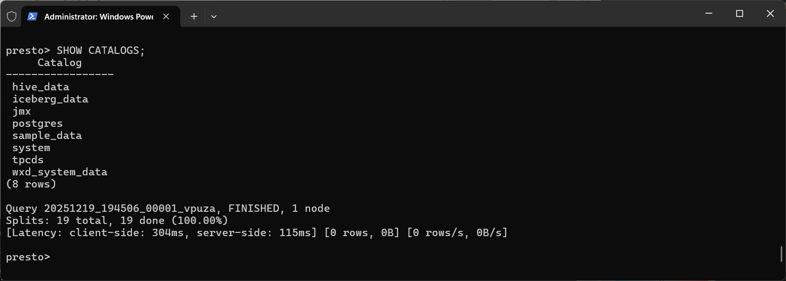
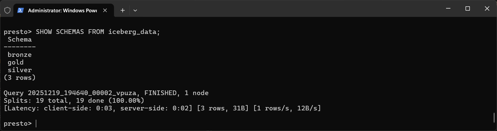

## Part 6. WatsonX.data Developer - Troubleshooting guide

This document collects various hints, tips and tricks in case your installation on WatsonX.data required troubleshooting. 

List of contents:
- [6.1. Solving error catalog xxx does not exist](#61-error-catalog-iceberg_data-does-not-exist)

### 6.1. Error Catalog iceberg_data does not exist.
This error happened many times on my laptop and I haven't yet figured out why it may happen. It's the problem with Presto, not the Iceberg tables. You log in into your WatsonX.data Developer UI like everyday but unexpectedly in the moment of browing your tables in the Data Manager view or Query workspace view those navigation tree items don't expand and you receive error popup messages on the right side of the screen, just like on the picture below:



In Powershell terminal started as Administrator run command:
```powershell
kubectl get pods -n wxd | Select-String lhams-api
```

The pod lhams-api should be running normally.



Restart the pod's deployment with this command:

```powershell
kubectl rollout restart deploy/lhams-api -n wxd
```



Then restart lhconsole-api pod with this command:

```powershell
kubectl rollout restart deploy/lhconsole-api -n wxd
```



Then delete the ibm-lh-presto pod:

```powershell
kubectl delete pod -n wxd -l app=ibm-lh-presto
```



See that new Presto pod was automatically deployed:

```powershell 
kubectl get pods -n wxd | Select-String ibm-lh-presto
```



Then log into the new Presto pod shell:

```powershell
kubectl exec -n wxd -it deploy/ibm-lh-presto -- presto --server https://localhost:8443 --insecure --user ibmlhadmin --password
```



In Presto, run few commands to see if the catalogs and tables were all recreated ok:

```sql
SHOW CATALOGS;
```



and:

```sql
SHOW SCHEMAS FROM iceberg_data;
```


You can exit:

```sql
exit
```

and go to the browser and see Data Manager or Query Workspace to confirm that all schemas and catalogs have been recreated from Apache Iceberg correctly. 

This is the end of Part 6. Troubleshooting.

[Back to Readme.md](./README.md)